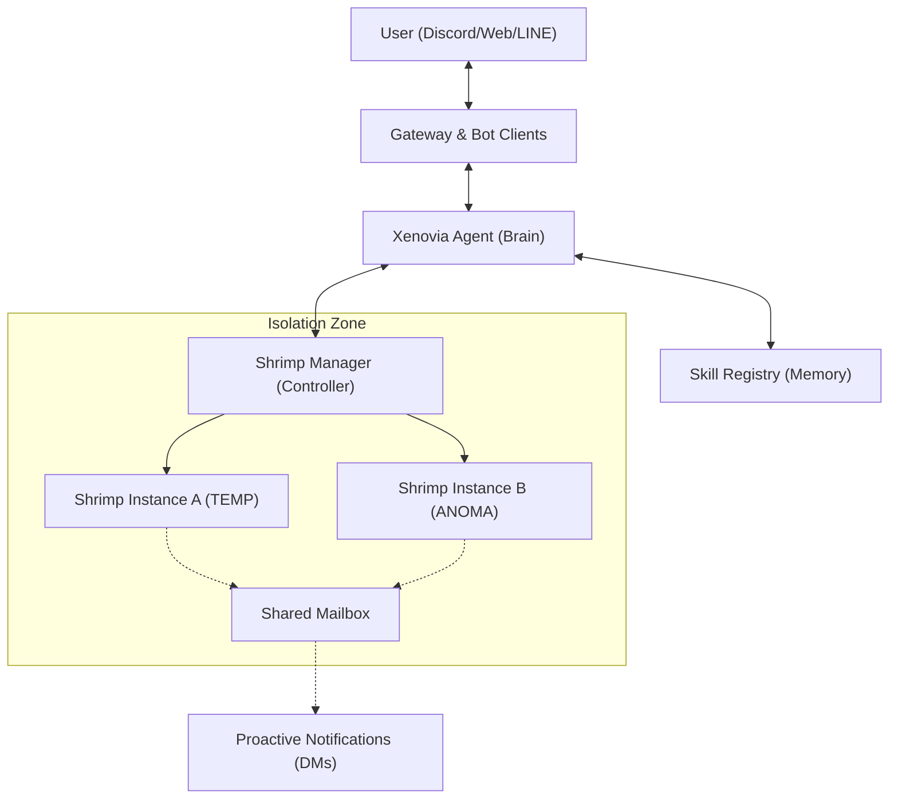

# 🏗️ Architecture

Xenovia follows a robust "Brain-Body-Sandbox" architecture designed for maximum capability with strict safety boundaries.

## System Diagram

## Core Components

### 1. Gateway & Bot Clients
The entry points into Xenovia. Handles multi-platform message ingestion, validates user identities, maps external IDs (like Discord snowflakes or LINE IDs) to internal canonical identities, and routes requests to the core Agent.

### 2. Xenovia Agent (The Brain)
The reasoning engine. It:
- Decides which tools to use.
- Uses RAG (Pinecone + ChromaDB) to retrieve context.
- Formulates multi-step execution plans.
- Communicates back to the user via Natural Language.

### 3. Shrimp Manager (The Controller)
Orchestrates isolated execution environments. It creates, monitors, and terminates Docker containers based on the Agent's instructions.

### 4. Isolation Zone (The Sandbox)
Docker-powered execution instances (`Shrimps`). This is where arbitrary Python code generated by the Agent runs. It is completely isolated from the host machine to prevent accidental damage or security breaches.
- **TEMP Instances**: Spin up to execute a single task and immediately shut down.
- **ANOMA Instances**: Persistent background workers.

### 5. Skill Registry
A self-evolving database where successfully executed code functions are analyzed, generalized, and stored as native tools (MCPs) for future use by the Agent.
